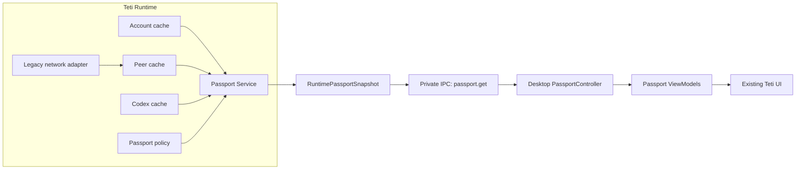
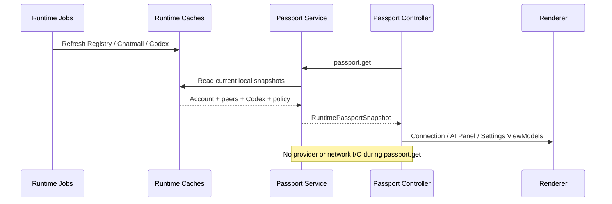
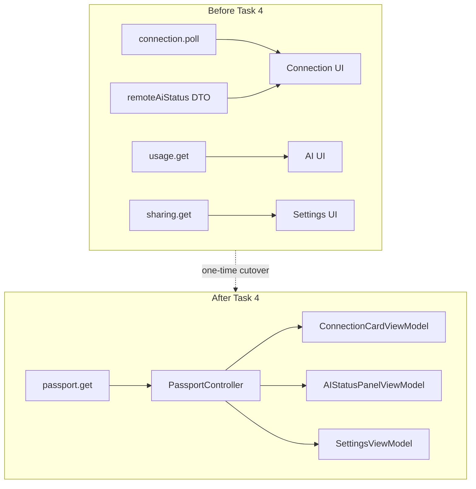

# Teti Beta MVP 1.0 Passport Domain Integration

Status: Implemented
Flow: Runtime → Passport → Desktop ViewModel → UI

## Decision

Runtime is the single source for every Passport value displayed by Desktop. Desktop performs one local `passport.get` read every three seconds and never combines Connection, Codex usage, remote AI status, or sharing DTOs itself.

Explicit account, Registry retry, connection request, accept, reject, and sharing changes remain commands. A Snapshot read is local-only and never initiates provider or network work.

## Architecture Diagram

## Data Flow Diagram

## Migration Diagram

## Snapshot Contract

`RuntimePassportSnapshot` contains:

- nullable local identity;
- one frozen `TetiCapabilityPassport` containing current resources and empty Agent, Capability, and Binding arrays;
- connection projections with identity, relationship state, last seen time, and remote Passport;
- `PassportSharingPolicy`;
- a stable revision and generation timestamp.

The Snapshot has no global expiry. Local resources and remote Passports retain their own observation and expiry times.

Remote Passport state is:

- `fresh`: an enabled payload exists and has not expired;
- `stale`: an enabled payload reached its TTL;
- `disabled`: the peer explicitly sent disabled sharing;
- `unknown`: Runtime has no reliable evidence. It does not claim the peer never shared.

## Adapters

| Runtime source | Passport target |
| --- | --- |
| Local Teti account | `PassportIdentity` |
| `CodexUsageState` | generic `AiResource` |
| Peer connection cache | `PassportConnectionSnapshot` |
| `RemoteAiStatusSnapshot` | remote Passport state and generic resources |
| old `statusSharing:boolean` file | one-time `PassportSharingPolicy` migration |

The old `teti.ai.status.sync` wire payload remains the active network adapter for resource-summary sharing in this release. No new provider or Teti network message is introduced.

## Desktop Boundary

Renderer receives presentation-ready ViewModels. It does not parse TTLs, inspect `openai.codex`, read `statusSharing`, or import Registry, Chatmail, Codex usage, or remote AI-status DTOs.

Provider-specific icon and plan presentation is isolated in the Passport ViewModel. Adding another resource later requires a Runtime mapper and presentation mapping, not another UI data controller.

## Privacy

- Passport aggregation reads sanitized Runtime state only.
- Credentials, access tokens, account identifiers, raw provider responses, prompts, files, and conversations are excluded.
- Sharing defaults off.
- The current UI toggle changes `resourceSummary` and `resourceQuota` together; Agent and Capability sharing remain false and unimplemented.
- Network broadcasting is scheduled asynchronously after local policy persistence, so the UI never waits on a peer network queue.
