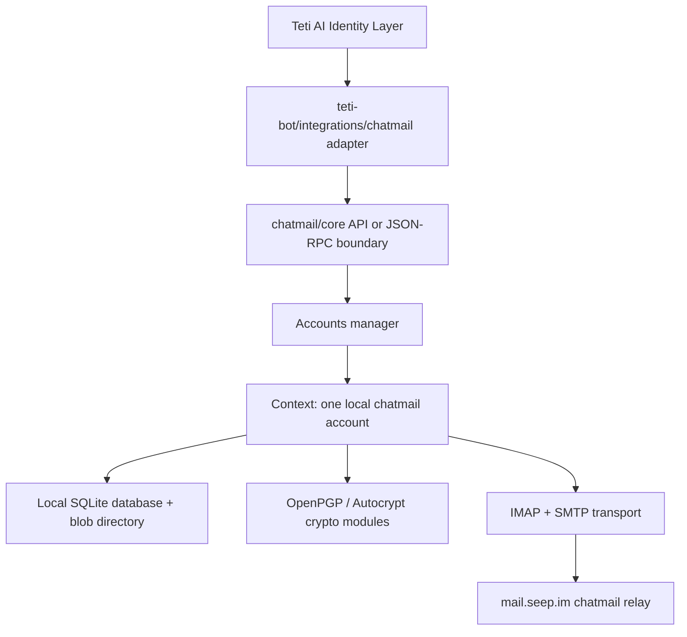

# Chatmail/Core Integration Analysis

Source inspected: `/Users/macstudio/Documents/AICoRun/core`

This document analyzes how Teti should integrate with the existing chatmail/core foundation. Teti should treat chatmail/core as the trusted identity and encrypted communication substrate, not as code to rewrite or fork.

## Architecture Diagram



## Important Source Files

- `/Users/macstudio/Documents/AICoRun/core/src/accounts.rs`: multi-account manager, account directory creation/loading/removal.
- `/Users/macstudio/Documents/AICoRun/core/src/context.rs`: single-account runtime object, database open/close, blob directory, I/O scheduler.
- `/Users/macstudio/Documents/AICoRun/core/src/configure.rs`: account transport configuration and chatmail/email login setup.
- `/Users/macstudio/Documents/AICoRun/core/src/login_param.rs`: user-entered IMAP/SMTP login parameter objects.
- `/Users/macstudio/Documents/AICoRun/core/src/transport.rs`: configured transport model saved to the database.
- `/Users/macstudio/Documents/AICoRun/core/src/key.rs`: own key loading, lazy key generation, keypair persistence.
- `/Users/macstudio/Documents/AICoRun/core/src/pgp.rs`: OpenPGP key generation, encryption, signature validation, symmetric encryption.
- `/Users/macstudio/Documents/AICoRun/core/src/e2ee.rs`: higher-level encryption helper used by MIME rendering.
- `/Users/macstudio/Documents/AICoRun/core/src/decrypt.rs`: encrypted MIME detection and decryption.
- `/Users/macstudio/Documents/AICoRun/core/src/mimefactory.rs`: outgoing MIME construction, protected headers, Autocrypt headers, encryption.
- `/Users/macstudio/Documents/AICoRun/core/src/receive_imf.rs`: incoming message parsing, decryption, contact/chat assignment.
- `/Users/macstudio/Documents/AICoRun/core/src/chat.rs`: chat creation and message sending.
- `/Users/macstudio/Documents/AICoRun/core/src/contact.rs`: contacts, address lookup, contact creation.
- `/Users/macstudio/Documents/AICoRun/core/src/sql/tables.sql`: local database schema.
- `/Users/macstudio/Documents/AICoRun/core/deltachat-jsonrpc/src/api.rs`: existing JSON-RPC API surface for account, transport, contact, chat, and message operations.
- `/Users/macstudio/Documents/AICoRun/core/deltachat-rpc-server/npm-package/README.md`: Node-side stdio RPC server integration option.

## 1. Identity Lifecycle

In chatmail/core, the primary runtime identity object is a `Context`. A `Context` represents one local account and owns the database, blob directory, scheduler, self key cache, config cache, transport state, contacts, chats, and events.

Identity/account creation starts through the account manager:

- `Accounts::new(dir, writable)` creates or opens an accounts directory.
- `Accounts::ensure_accounts_dir()` creates `accounts.toml` for a new manager directory.
- `Accounts::add_account()` creates a new `AccountConfig`, builds a `Context`, opens its database, stores it in the in-memory account map, and returns an account id.
- `ContextBuilder::new(dbfile).build()` creates a closed context.
- `Context::new_closed()` creates the blob directory beside the SQLite database.
- `Context::open(passphrase)` opens the database. Database passphrases are deprecated; normal usage passes an empty string.

Transport configuration then gives the account its usable chatmail address:

- `Context::add_or_update_transport(&mut EnteredLoginParam)` is the current primary configuration API.
- `Context::add_transport_from_qr(qr)` configures from a `dcaccount:` or `dclogin:` QR.
- `Context::configure()` is deprecated legacy configuration.
- `configure::get_configured_param()` expands entered credentials into concrete IMAP/SMTP server parameters.
- `configure::configure()` validates IMAP and SMTP connectivity, detects chatmail, and writes the transport.
- `ConfiguredLoginParam::save_to_transports_table()` stores the working transport in the `transports` table.

Keys are generated lazily, not necessarily at account creation:

- `key::load_self_public_key()` loads the public key; if absent, it calls `generate_keypair()`.
- `key::load_self_secret_key()` loads the private key; if absent, it also calls `generate_keypair()`.
- `key::generate_keypair()` gets the configured primary self address and calls `pgp::create_keypair(addr)`.
- `pgp::create_keypair()` generates an OpenPGP secret key with an Ed25519 signing primary key and a Curve25519 ECDH encryption subkey.
- `key::store_self_keypair()` writes both public and private key bytes to the local SQLite `keypairs` table and stores the selected key row id in config key `key_id`.

Private keys are stored locally in the account database:

- Table: `keypairs`
- Columns: `private_key`, `public_key`
- Default selected key: `config.keyname = 'key_id'`

Identity is loaded later through:

- `Accounts::new()` / `Accounts::open()`
- `Config::from_file(accounts.toml)`
- `Config::load_accounts()`
- `ContextBuilder::new(dbfile).build()`
- `Context::open("")`
- `key::load_self_public_key_opt()`, `key::load_keypair()`, and `key::load_self_secret_keyring()` when keys are needed.

## 2. Account Lifecycle

Create account:

- `Accounts::new(dir, true)` creates the account manager directory if needed.
- `Accounts::add_account()` allocates an account id and UUID-backed account directory.
- `Config::new_account()` writes the new account to `accounts.toml` and selects it.
- `ContextBuilder` creates the account context for `<accounts-dir>/<uuid>/dc.db`.

Store identity:

- Configuration is stored through `Context::add_or_update_transport()` or `Context::add_transport_from_qr()`.
- Entered credentials are represented by `EnteredLoginParam`, `EnteredImapLoginParam`, and `EnteredSmtpLoginParam`.
- Working server parameters are represented by `ConfiguredLoginParam`.
- Transport data is saved in the `transports` table as `entered_param` and `configured_param` JSON.
- Own OpenPGP keys are stored in `keypairs` when `key::load_self_public_key()` or `key::load_self_secret_key()` first requires them.

Open account:

- `Accounts::new(dir, writable)` reads `accounts.toml`.
- `Config::load_accounts()` builds a `Context` for each configured account.
- `Context::open("")` opens the SQLite database.
- `Context::start_io()` starts network scheduler tasks once the account is configured.

Use account:

- `Context::start_io()` and `Context::background_fetch()` drive IMAP receive loops.
- `chat::send_msg()` and `chat::send_text_msg()` create outgoing messages and SMTP jobs.
- `receive_imf::receive_imf_inner()` parses downloaded messages and writes them into chats.
- `Context::wait_next_msgs()` and event APIs expose new messages to bot/UI layers.
- JSON-RPC exposes these operations through `deltachat-jsonrpc/src/api.rs`.

Delete account:

- `Accounts::remove_account(id)` removes the `Context` from memory.
- It calls `ctx.stop_io().await`.
- It explicitly closes `ctx.sql`.
- It removes the account data directory.
- It removes the account from `accounts.toml` through `Config::remove_account(id)`.

## 3. Cryptography Boundary

Teti should not duplicate any of this logic.

Key generation:

- `src/pgp.rs`: `create_keypair(addr)`
- `src/key.rs`: `generate_keypair(context)`, `store_self_keypair()`, `ensure_secret_key_exists()`

Key loading:

- `src/key.rs`: `load_self_public_key()`, `load_self_public_key_opt()`, `load_self_secret_key()`, `load_self_secret_keyring()`, `load_keypair()`

Public key material and Autocrypt:

- `src/e2ee.rs`: `EncryptHelper::new()`, `EncryptHelper::get_aheader()`
- `src/mimefactory.rs`: outgoing Autocrypt header and Autocrypt-Gossip handling.
- `src/mimeparser.rs`: incoming Autocrypt and Autocrypt-Gossip parsing/import.

Encryption:

- `src/e2ee.rs`: `EncryptHelper::encrypt()`, `EncryptHelper::encrypt_raw()`, `EncryptHelper::encrypt_symmetrically()`
- `src/pgp.rs`: `pk_encrypt()`, `symm_encrypt_message()`
- `src/mimefactory.rs`: chooses asymmetric or symmetric encryption and wraps encrypted MIME.

Decryption:

- `src/decrypt.rs`: `decrypt()`, `get_encrypted_pgp_message_boxed()`, `get_encrypted_mime()`
- `src/mimeparser.rs`: invokes `decrypt::decrypt()` while parsing incoming messages.

Signatures:

- `src/pgp.rs`: `pk_encrypt()` signs encrypted payloads with the self secret key.
- `src/pgp.rs`: `valid_signature_fingerprints()` validates message signatures.
- `src/pgp.rs`: `pk_validate()` validates detached signatures.

Authentication and secure join:

- `src/securejoin.rs`: QR/auth-token flow for verified contacts and secure join.
- `src/token.rs`: `Namespace::Auth` token storage.
- `src/decrypt.rs`: symmetric secure-join decryption checks auth tokens and broadcast secrets.

## 4. Storage Model

The account manager directory contains:

- `accounts.toml`: account list, selected account id, next id, account order.
- `accounts.lock`: lock file on non-iOS platforms.
- One UUID-named directory per account.

Each account directory contains:

- `dc.db`: SQLite database.
- `dc.db-blobs`: blob directory for files/attachments.
- `dc.db-wal`: SQLite WAL file when present.

Important database tables:

- `config`: account configuration, including `configured_addr`, `configured`, `is_chatmail`, and `key_id`.
- `transports`: entered and configured IMAP/SMTP/chatmail transport JSON plus timestamps and publication state.
- `keypairs`: local OpenPGP public/private key bytes.
- `contacts`: contacts, addresses, fingerprints, contact metadata.
- `chats`, `chats_contacts`: chat state and membership.
- `msgs`: message state, text, timestamps, headers, metadata.
- `jobs`: outgoing/send and background jobs.
- `tokens`: auth tokens such as secure-join tokens.
- `acpeerstates`: peer public keys and Autocrypt state.

Local data required by Teti if it uses chatmail/core:

- Accounts directory path controlled by Teti.
- chatmail address and credentials used to configure `EnteredLoginParam`.
- Local SQLite database and blob directory owned by chatmail/core.
- Teti-side mapping from Teti identity id to chatmail account id/address.
- Teti-side public profile and discovery registry state.

Teti should not move chatmail private keys out of the account database unless using official import/export APIs. It should also avoid storing chatmail credentials in its own profile schema.

## 5. Recommended Teti Integration Boundary

Recommended boundary: a thin adapter in `teti-bot/integrations/chatmail/` that delegates account, crypto, transport, and message persistence to chatmail/core.

Two implementation options are viable:

- Direct Rust integration if Teti Desktop embeds Rust and links against core.
- JSON-RPC/stdout integration using `deltachat-rpc-server` and the existing Node package described in `deltachat-rpc-server/npm-package/README.md`.

For Tauri/TypeScript, JSON-RPC is likely the lower-friction boundary because it avoids copying bindings and keeps chatmail/core behind its supported RPC interface.

Proposed adapter interfaces:

```ts
interface ChatmailAccountInput {
  address: string;
  password: string;
  imapServer?: string;
  smtpServer?: string;
  qr?: string;
}

interface ChatmailIdentity {
  accountId: number;
  address: string;
  isConfigured: boolean;
  isChatmail: boolean;
  publicKey?: string;
  fingerprint?: string;
}

interface ChatmailAdapter {
  createAccount(input: ChatmailAccountInput): Promise<ChatmailIdentity>;
  loadIdentity(accountId: number): Promise<ChatmailIdentity>;
  sendMessage(accountId: number, peerAddress: string, text: string): Promise<{ messageId: number }>;
  receiveMessage(accountId: number): Promise<Array<{ messageId: number; chatId: number }>>;
  deleteAccount(accountId: number): Promise<void>;
}
```

Suggested mapping to chatmail/core:

- `createAccount()`: `add_account()` then `add_or_update_transport()` or `add_transport_from_qr()`, then `start_io()`.
- `loadIdentity()`: `get_account_info()`, `is_configured()`, `get_config("configured_addr")`, possibly a small upstream/core API for exported public key/fingerprint if RPC does not expose it directly.
- `sendMessage()`: `lookup_contact_id_by_addr()`, `create_contact()` when appropriate, `create_chat_by_contact_id()`, then `send_msg()` or `misc_send_text_message()`.
- `receiveMessage()`: prefer event stream / `IncomingMsg`; use `wait_next_msgs()` only for early bot experiments because the RPC docs mark it deprecated for fully downloaded-message workflows.
- `deleteAccount()`: stop I/O then `remove_account()` through the account manager/RPC surface.

## 6. What Teti Should Reuse

Teti should reuse chatmail/core for:

- chatmail account creation and transport configuration.
- IMAP/SMTP connectivity and mail.seep.im relay communication.
- local account database and blob storage.
- key generation and private key storage.
- OpenPGP encryption/decryption/signature validation.
- Autocrypt headers, Autocrypt-Gossip, protected headers.
- secure join/auth-token flows.
- contact, chat, message, and outgoing job lifecycle.
- background fetch, scheduler, and event stream.

## 7. What Teti Should Not Implement Itself

Teti should not implement:

- a new encryption system.
- OpenPGP key generation or key serialization.
- private key persistence outside chatmail/core.
- MIME encryption/decryption or protected-header handling.
- Autocrypt or secure-join parsing.
- IMAP/SMTP send/receive loops.
- message database schema or send job queue.
- chatmail credential synchronization through Teti public discovery.

Teti's role should be the AI identity and discovery layer. It can publish a public identity card containing a Teti id, public profile, chatmail address, and public key/fingerprint. The private identity, message history, credentials, trusted contacts, and cryptographic state remain inside the local chatmail/core account.

