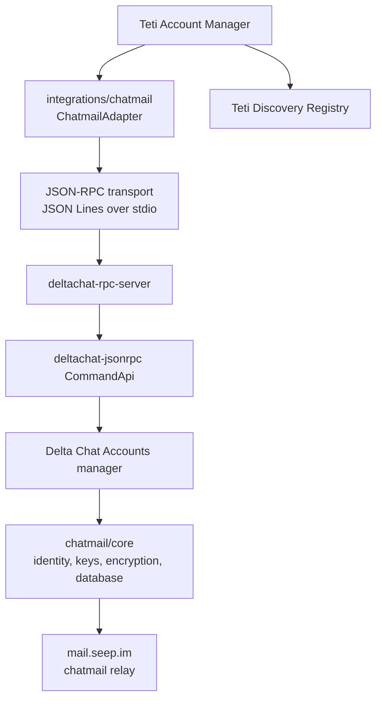

# Chatmail RPC API Analysis

This document records source-based API discovery for the Teti Chatmail Adapter. It inspects the local chatmail sources only; no changes were made to `chatmail/core` or `chatmail/relay`.

> Update after runtime verification: `/Users/macstudio/Documents/AICoRun/core/target/release/deltachat-rpc-server --openrpc` shows that the local JSON-RPC wire method names are snake_case, not camelCase. This document keeps the original source-analysis trail, but implementation should follow `docs/chatmail-openrpc-verification.md` for the final runtime contract.

Sources inspected:

- Core: `/Users/macstudio/Documents/AICoRun/core`
- Relay: `/Users/macstudio/Documents/SeepAI/chatmail/relay`
- Teti adapter: `/Users/macstudio/Documents/MidiMily/teti-bot/integrations/chatmail`

## Architecture



The boundary for Teti is JSON-RPC. Teti should not call Rust APIs directly, copy crypto code, inspect private key storage, or implement message encryption.

## RPC Server Location

The RPC server is implemented in:

- `/Users/macstudio/Documents/AICoRun/core/deltachat-rpc-server/src/main.rs`

Important functions and behavior:

- `main_impl()`
  - Handles `--version`.
  - Handles `--openrpc` by printing `CommandApi::openrpc_specification()`.
  - Reads account directory from `DC_ACCOUNTS_PATH`; defaults to `accounts`.
  - Creates `Accounts::new(PathBuf::from(&path), writable).await`.
  - Creates `CommandApi::from_arc(accounts.clone()).await`.
  - Uses `yerpc::{RpcClient, RpcSession}`.
  - Reads JSON-RPC requests line-by-line from stdin.
  - Writes JSON-RPC responses line-by-line to stdout.
  - Sends logs to stderr, so stdout stays JSON-only.

RPC method registration is defined in:

- `/Users/macstudio/Documents/AICoRun/core/deltachat-jsonrpc/src/api.rs`

Important declaration:

```rust
#[rpc(all_positional, ts_outdir = "typescript/generated")]
impl CommandApi
```

This has two integration consequences:

1. RPC parameters are positional. Teti should send `params` arrays, not named parameter objects.
2. Rust method names are snake_case in source, while the TypeScript tests use generated camelCase client methods such as `addAccount()`, `getAccountInfo()`, `batchSetConfig()`, and `makeVcard()`.

Example JSON-RPC shape:

```json
{"jsonrpc":"2.0","id":1,"method":"addAccount","params":[]}
{"jsonrpc":"2.0","id":2,"method":"getAccountInfo","params":[1]}
```

Before implementation, the exact wire method names should be verified once with:

```sh
deltachat-rpc-server --openrpc
```

The source tests strongly indicate camelCase method names on the generated client. The current Teti adapter uses snake_case names and object parameters, which does not match the discovered contract.

## Account Lifecycle RPCs

The following methods are defined in `/Users/macstudio/Documents/AICoRun/core/deltachat-jsonrpc/src/api.rs`.

| Teti need | Rust function | Expected RPC method | Parameters | Return |
| --- | --- | --- | --- | --- |
| Create local account container | `add_account` | `addAccount` | `[]` | `number` account id |
| Migrate existing database | `migrate_account` | `migrateAccount` | `[pathToDb: string]` | `number` account id |
| Delete account | `remove_account` | `removeAccount` | `[accountId: number]` | `void` |
| List account ids | `get_all_account_ids` | `getAllAccountIds` | `[]` | `number[]` |
| List accounts | `get_all_accounts` | `getAllAccounts` | `[]` | `Account[]` |
| Select account | `select_account` | `selectAccount` | `[accountId: number]` | `void` |
| Get selected account | `get_selected_account_id` | `getSelectedAccountId` | `[]` | `number | null` |
| Start IO | `start_io` | `startIo` | `[accountId: number]` | `void` |
| Stop IO | `stop_io` | `stopIo` | `[accountId: number]` | `void` |
| Account info | `get_account_info` | `getAccountInfo` | `[accountId: number]` | `Account` |
| Is configured | `is_configured` | `isConfigured` | `[accountId: number]` | `boolean` |
| Set config | `set_config` | `setConfig` | `[accountId: number, key: string, value: string | null]` | `void` |
| Batch set config | `batch_set_config` | `batchSetConfig` | `[accountId: number, config: Record<string, string | null>]` | `void` |
| Get config | `get_config` | `getConfig` | `[accountId: number, key: string]` | `string | null` |
| Batch get config | `batch_get_config` | `batchGetConfig` | `[accountId: number, keys: string[]]` | `Record<string, string | null>` |
| Configure legacy account | `configure` | `configure` | `[accountId: number]` | `void` |
| Configure transport | `add_or_update_transport` | `addOrUpdateTransport` | `[accountId: number, param: EnteredLoginParam]` | `void` |
| Configure from QR | `add_transport_from_qr` | `addTransportFromQr` | `[accountId: number, qr: string]` | `void` |
| List transports | `list_transports` | `listTransports` | `[accountId: number]` | `EnteredLoginParam[]` |
| Delete transport | `delete_transport` | `deleteTransport` | `[accountId: number, addr: string]` | `void` |

### Account Response Shape

`Account` is defined in:

- `/Users/macstudio/Documents/AICoRun/core/deltachat-jsonrpc/src/api/types/account.rs`

Configured account:

```ts
{
  kind: "Configured",
  id: number,
  displayName?: string | null,
  addr?: string | null,
  profileImage?: string | null,
  color: string,
  privateTag?: string | null
}
```

Unconfigured account:

```ts
{
  kind: "Unconfigured",
  id: number
}
```

Teti should map `addr` to `ChatmailIdentity.address` and derive `isConfigured` from `kind === "Configured"`, or call `isConfigured(accountId)`.

## Account Creation and Configuration

The current source supports two configuration styles.

### Modern Transport Configuration

Function:

- `add_or_update_transport(account_id, param)`

Expected RPC:

```ts
addOrUpdateTransport(accountId, {
  addr: "xxxxxxxxx@mail.seep.im",
  password: "password",
  imapServer?: string,
  imapPort?: number,
  imapFolder?: string,
  imapSecurity?: "Automatic" | "Ssl" | "Starttls" | "Plain",
  imapUser?: string,
  smtpServer?: string,
  smtpPort?: number,
  smtpSecurity?: "Automatic" | "Ssl" | "Starttls" | "Plain",
  smtpUser?: string,
  smtpPassword?: string,
  certificateChecks?: "Automatic" | "Strict" | "AcceptInvalidCertificates",
  oauth2?: boolean
})
```

`EnteredLoginParam` is defined in:

- `/Users/macstudio/Documents/AICoRun/core/deltachat-jsonrpc/src/api/types/login_param.rs`

The comments say it is usually enough to set only `addr` and `password`; server settings are autoconfigured.

### Legacy Config + Configure Flow

The online tests still use this flow:

- `/Users/macstudio/Documents/AICoRun/core/deltachat-jsonrpc/typescript/test/online.ts`

Example:

```ts
const accountId = await dc.rpc.addAccount();
await dc.rpc.setConfig(accountId, "addr", account.email);
await dc.rpc.setConfig(accountId, "mail_pw", account.password);
await dc.rpc.configure(accountId);
await waitForEvent(dc, "ImapInboxIdle", accountId);
```

This works, but `configure()` is marked deprecated in source as of 2025-02. Teti should prefer `addOrUpdateTransport()` once the JSON-RPC payload is wired correctly.

## Identity Methods

### Email Address

Best source:

- `getAccountInfo(accountId)` returns `Account.Configured.addr`.

Fallback:

- `getConfig(accountId, "addr")`

### Display Name

Best source:

- `getAccountInfo(accountId)` returns `displayName`.

Fallback:

- `getConfig(accountId, "displayname")`

### Public Key

There is no discovered `getPublicIdentity` RPC method in `CommandApi`.

The source-supported route is:

- `make_vcard(account_id, contacts)` in `/Users/macstudio/Documents/AICoRun/core/deltachat-jsonrpc/src/api.rs`
- Expected RPC: `makeVcard(accountId, [1])`
- `1` is `DC_CONTACT_ID_SELF`, used by the TypeScript online tests as `C.DC_CONTACT_ID_SELF`.

The returned vCard can contain the public key. Teti may parse the vCard text for public identity export, but must not export private key material.

### Fingerprint

There is no clean machine-readable own-key fingerprint RPC found.

Available but not ideal:

- `get_contact_encryption_info(account_id, contact_id)`
- Expected RPC: `getContactEncryptionInfo(accountId, 1)`
- Return: multi-line human-readable encryption info containing fingerprints.

Recommendation:

- Do not depend on parsing human-readable encryption info for Teti identity.
- Either leave `fingerprint` undefined or request/add an upstream JSON-RPC method in chatmail/core that exposes a public-only identity object.

## Messaging RPCs Relevant to Future Adapter Work

The current Teti adapter assumes `misc_send_text_message` can send to a peer address. The real RPC sends to a chat id.

Send flow from source and tests:

1. Get/import contact:
   - `lookupContactIdByAddr(accountId, addr)` returns `number | null`
   - or `createContact(accountId, email, name)` returns `number`
   - for encrypted contact bootstrap, the online test imports vCard with `importVcardContents(accountId, vcard)`.
2. Create chat:
   - `createChatByContactId(accountId, contactId)` returns `chatId`.
3. Send:
   - `miscSendTextMessage(accountId, chatId, text)` returns `messageId`.

Receive flow:

- Preferred source model is event-based.
- `getNextEventBatch()` returns events from the RPC event queue.
- `IncomingMsg` event has `{ chatId, msgId }`.
- `getMessage(accountId, msgId)` returns the message object.

Deprecated bot methods exist:

- `getNextMsgs(accountId)`
- `waitNextMsgs(accountId)`

The source comments mark both deprecated as of 2026-04 and recommend using `IncomingMsg` events instead.

## Relay Analysis: mail.seep.im

Relay configuration:

- `/Users/macstudio/Documents/SeepAI/chatmail/relay/chatmail.ini`

Important values:

```ini
mail_domain = mail.seep.im
username_min_length = 9
username_max_length = 9
password_min_length = 9
```

Account generation endpoint:

- `/Users/macstudio/Documents/SeepAI/chatmail/relay/chatmaild/src/chatmaild/newemail.py`
- Nginx exposes it at `/new` in `/Users/macstudio/Documents/SeepAI/chatmail/relay/cmdeploy/src/cmdeploy/nginx/nginx.conf.j2`.

`/new` returns JSON:

```json
{
  "email": "random9ch@mail.seep.im",
  "password": "generated-password"
}
```

The auth layer also supports creation on first successful passdb lookup:

- `/Users/macstudio/Documents/SeepAI/chatmail/relay/chatmaild/src/chatmaild/doveauth.py`
- Function: `lookup_passdb(addr, cleartext_password)`
- If the user does not exist and `is_allowed_to_create()` passes, it creates the mailbox by calling `user.set_password(...)`.

Creation requirements:

- `/etc/chatmail-nocreate` must not exist.
- Password length must be at least `password_min_length`.
- Address must be a proper `local@domain` address.
- Domain must match configured `mail_domain`.
- Local part length must be between `username_min_length` and `username_max_length`.

### How Teti Should Create `teti_xxx@mail.seep.im`

With the current relay config, Teti should not assume it can create `teti_xxx@mail.seep.im`.

Reason:

- `teti_xxx` is 8 characters.
- Current `mail.seep.im` config requires exactly 9 characters.
- The default `/new` generator returns random 9-character usernames, not Teti-prefixed names.

Viable options:

1. Use relay-generated random addresses from `https://mail.seep.im/new`, then store the Teti AI identity/profile in the Teti Discovery Registry.
2. Generate a Teti-looking but exactly 9-character local part, for example `teti` + 5 safe characters, and configure with a password of at least 9 characters. This relies on first-login creation and must avoid collisions.
3. Change relay policy outside Teti adapter scope if human-readable `teti_xxx` names are required. That would be a relay configuration/product decision, not a Teti adapter change.

Recommendation for V1:

- Use random or 9-character compliant chatmail addresses.
- Put Teti semantics in public profile/discovery, not in the email local part.

## Comparison With Current Teti Adapter

Current files:

- `/Users/macstudio/Documents/MidiMily/teti-bot/integrations/chatmail/rpc-client.ts`
- `/Users/macstudio/Documents/MidiMily/teti-bot/integrations/chatmail/real-adapter.ts`
- `/Users/macstudio/Documents/MidiMily/teti-bot/integrations/chatmail/types.ts`

### Current Assumption vs Real API

| Teti adapter method | Current assumption | Real source-backed mapping |
| --- | --- | --- |
| `addAccount()` | `"add_account"` with no params | `addAccount` with `params: []` |
| `getAccountInfo(accountId)` | `"get_account_info"` with `{ accountId }` | `getAccountInfo` with `[accountId]`; map `kind`, `addr`, `displayName` |
| `configureAccount()` QR | `"add_transport_from_qr"` with object params | `addTransportFromQr` with `[accountId, qr]` |
| `configureAccount()` password | `"add_or_update_transport"` with nested `imap`/`smtp` object | `addOrUpdateTransport` with `[accountId, EnteredLoginParam]`; shape is flat camelCase, usually `{ addr, password }` is enough |
| `startIo(accountId)` | `"start_io"` with `{ accountId }` | `startIo` with `[accountId]` |
| `stopIo(accountId)` | `"stop_io"` with `{ accountId }` | `stopIo` with `[accountId]` |
| `getPublicIdentity(accountId)` | `"get_public_identity"` exists | No such method found; use `makeVcard(accountId, [1])` for public key; no stable fingerprint RPC found |
| `sendTextMessage(input)` | `"misc_send_text_message"` with peer address | `miscSendTextMessage(accountId, chatId, text)` after contact/chat creation |
| `receiveMessages(input)` | `"receive_messages"` exists | No such method found; use event loop `getNextEventBatch` + `IncomingMsg` + `getMessage` |
| `removeAccount(accountId)` | `"remove_account"` with `{ accountId }` | `removeAccount` with `[accountId]` |

## Required Changes Before Real Adapter Implementation

1. Update `JsonRpcClientTransport.request()` callers to send positional arrays.
2. Replace snake_case method strings with the generated/client method names confirmed by `--openrpc`, expected camelCase.
3. Change account mapping to use the real `Account` enum shape:
   - `kind: "Configured"` or `kind: "Unconfigured"`
   - `addr`, not `address`
   - no `isChatmail` field from core; Teti may infer chatmail from the integration path.
4. Replace the `get_public_identity` assumption:
   - use `makeVcard(accountId, [1])` for public key extraction.
   - leave fingerprint unset unless chatmail/core exposes a structured public fingerprint method.
5. Replace send-by-address with contact/chat flow:
   - `lookupContactIdByAddr`
   - `createContact` or `importVcardContents`
   - `createChatByContactId`
   - `miscSendTextMessage`
6. Replace `receive_messages` with event-driven receive:
   - `getNextEventBatch`
   - handle `IncomingMsg`
   - call `getMessage`
7. Use `DC_ACCOUNTS_PATH` when launching `deltachat-rpc-server` so Teti can isolate the chatmail account manager directory without storing private keys or database paths in Teti account metadata.
8. Do not store chatmail passwords, private keys, or database paths in `~/.teti/account.json`.

## Recommended Teti Integration Boundary

Teti should keep this responsibility split:

- Chatmail/core answers: secure account, local identity, private keys, encrypted messaging, database, relay communication.
- Teti answers: AI identity profile, capabilities, lifecycle state, discovery registration.
- Cloudflare Registry answers: which Teti identities exist and what public profile they advertise.

The real adapter should be a narrow JSON-RPC client that translates Teti lifecycle calls into chatmail/core calls. It should not become a crypto layer, key manager, or storage layer for chatmail secrets.
