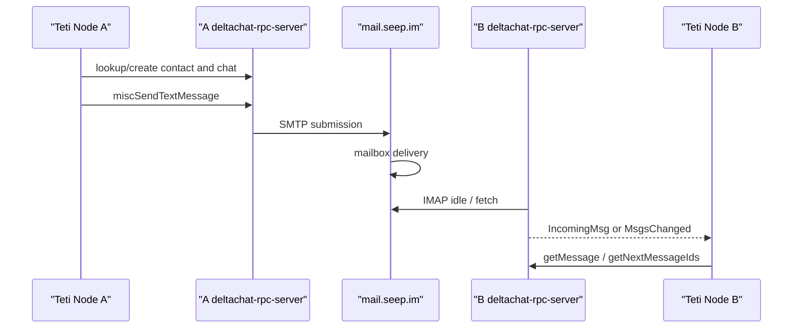

# Teti Alpha 1.0 Delivery Matrix Diagnosis

Date: 2026-07-14

This document isolates the current Alpha 1.0 blocker:

Teti A can send an encrypted chatmail message and the sender side reports delivery-like state, but Teti B does not observe an `IncomingMsg` or a Teti envelope.

The diagnosis scope is intentionally narrow: identity, discovery, chatmail delivery, and trust message transport. This is not a protocol redesign and does not add UI, environment scanning, task collaboration, or message history.

## Architecture



## Diagnostic Script

The real two-node diagnostic script is:

```bash
node --experimental-strip-types scripts/teti-alpha1-real-message-e2e.ts
```

Useful flags:

```bash
--same-host
--poll-seconds 180
--plain-text
--sender-account-path /path/to/node-a/teti/account.json
--receiver-account-path /path/to/node-b/teti/account.json
```

The script records:

- A and B chatmail account paths
- A and B account ids
- A and B addresses
- `startIo` status
- sender message ids and message status snapshots
- B `getNextMessageIds` before and after send
- B event diagnostics, including event types and ignored messages
- safe previews only for Teti envelopes or the diagnostic plain text body

The script does not log credentials, private keys, passwords, database contents, or full normal message bodies.

## Case A: Teti A to Teti B, Same Host

Command:

```bash
node --experimental-strip-types scripts/teti-alpha1-real-message-e2e.ts --same-host --poll-seconds 180
```

Expected success:

- A creates a `teti.connection.request`
- A sender status progresses
- B event stream sees `IncomingMsg` or `MsgsChanged`
- B `getNextMessageIds` changes
- B parses the Teti envelope

Failure shape already observed before this matrix:

- A encrypted send succeeds
- A message status reaches state `26`
- A `showPadlock` is `true`
- B `startIo` succeeds
- B sees `ImapConnected` and `ImapInboxIdle`
- B only sees local device messages through `getNextMessageIds`
- B never sees the Teti envelope

This shape separates the problem from Teti envelope parsing unless a plain text diagnostic message arrives while Teti envelope does not.

## Case B: Teti A to Teti B, Different Host or Network

Purpose: test whether same-host or same-public-IP behavior is part of the blocker.

On host B, create or reuse an independent Teti installation and keep its `account.json` path. Do not copy A's account directory.

Example B-side path shape:

```bash
/path/to/teti-node-b/teti/account.json
```

On host A, send to B after B is registered in the discovery registry. Do not hardcode machine-specific paths in committed code. For local reuse of an existing sender account:

```bash
node --experimental-strip-types scripts/teti-alpha1-real-message-e2e.ts \
  --poll-seconds 180 \
  --sender-account-path /path/to/teti-node-a/teti/account.json
```

Expected interpretation:

- If different-network delivery succeeds while same-host delivery fails, investigate relay policy, rate limiting, same-IP anti-abuse behavior, or freshly provisioned account restrictions.
- If different-network delivery also fails, focus on relay delivery, mailbox provisioning, or the Teti send bridge.

## Case C: Delta Chat Desktop to B Address

Purpose: determine whether B can receive at all from a known working Delta Chat sender.

Steps:

1. Start B's Teti runtime and receive polling.
2. From a known working Delta Chat Desktop account, send a normal message to B's chatmail address.
3. Watch B diagnostics for `IncomingMsg`, `MsgsChanged`, and `getNextMessageIds` changes.

Expected interpretation:

- If B still does not receive, suspect B mailbox provisioning, relay delivery into B's mailbox, or B runtime lifecycle.
- If B receives Desktop messages, suspect Teti A's send/contact/chat path.

## Case D: Teti A to Delta Chat Desktop B

Purpose: determine whether Teti A can deliver to a known working receiver.

Steps:

1. Use a known working Delta Chat Desktop-controlled chatmail address as the recipient.
2. Run the Teti sender with an existing A account, or adapt the diagnostic script recipient to that address for a one-off local run.
3. Confirm whether Desktop receives the message.

Expected interpretation:

- If Desktop receives, Teti A's send path works and B receive/mailbox becomes the primary suspect.
- If Desktop does not receive, investigate Teti A send path, relay submission, contact setup, or account reputation.

## Case E: Plain Text Diagnostic Send

Purpose: remove Teti envelope parsing from the equation.

Command:

```bash
node --experimental-strip-types scripts/teti-alpha1-real-message-e2e.ts --same-host --plain-text --poll-seconds 180
```

The diagnostic body is:

```text
hello from teti alpha delivery test
```

The send path is intentionally the same chatmail RPC path:

```text
lookupContactIdByAddr
createContact, if needed
createChatByContactId
miscSendTextMessage
```

Expected interpretation:

- If plain text also does not arrive, the blocker is not Teti envelope parsing.
- If plain text arrives but a Teti envelope does not, focus on envelope filtering or receive-side parser rules.

## Relay Log Checklist

Check mail.seep.im server logs only where authorized. Do not assume server paths until verified on that host.

Look for:

- SMTP submission from A's account
- `RCPT TO` B's address
- final delivery into B's mailbox
- Dovecot/IMAP visibility for B
- bounces or rejections
- rate limits, policy rejects, or anti-abuse throttles
- spam or quarantine decisions

Example commands once the actual service names are verified:

```bash
journalctl -u postfix --since "2026-07-14 00:00"
journalctl -u dovecot --since "2026-07-14 00:00"
journalctl --since "2026-07-14 00:00" | grep -F "recipient@example.org"
```

Replace service names and addresses with the actual relay configuration. Do not paste credentials into logs or issue trackers.

## Observed Results On 2026-07-14

Case A, same-host Teti connection request:

- Command: `node --experimental-strip-types scripts/teti-alpha1-real-message-e2e.ts --same-host --poll-seconds 180`
- Result: `send_succeeded_receive_failed`
- A account path: `/var/folders/.../teti-alpha1-real-message-4dzxVA/node-a/chatmail-accounts`
- B account path: `/var/folders/.../teti-alpha1-real-message-4dzxVA/node-b/chatmail-accounts`
- A account id: `1`
- B account id: `1`
- A address: `xqbokfyqq@mail.seep.im`
- B address: `tr9gzlzmc@mail.seep.im`
- A message id: `13`
- A message status progression: `20 -> 26`
- A `showPadlock`: `true`
- B `startIo`: `ok`
- B event stream: `Info`, `ConnectivityChanged`, `NewBlobFile`, `ImapConnected`, `ImapInboxIdle`, plus long-poll timeout events
- B `getNextMessageIds`: `[11]` only
- B fetched message: local `device@localhost` message only
- B never reached `PendingApproval`

Case E, same-host non-envelope diagnostic text:

- Command: `node --experimental-strip-types scripts/teti-alpha1-real-message-e2e.ts --same-host --plain-text --poll-seconds 180`
- Result: `send_succeeded_receive_failed`
- A account path: `/var/folders/.../teti-alpha1-real-message-8J89j2/node-a/chatmail-accounts`
- B account path: `/var/folders/.../teti-alpha1-real-message-8J89j2/node-b/chatmail-accounts`
- A account id: `1`
- B account id: `1`
- A address: `juknwteab@mail.seep.im`
- B address: `ifax7mesv@mail.seep.im`
- A message id: `13`
- A message status progression: `20 -> 26`
- A `showPadlock`: `true`
- B `startIo`: `ok`
- B `getNextMessageIds` before send: `[11]`
- B `getNextMessageIds` after send: `[11]`
- B only fetched the local device message
- The diagnostic body did not arrive

Interpretation:

- The send bridge can create a chatmail message and the sender runtime reports a delivered-like state.
- B's runtime is alive and connected to IMAP, but the remote message is not visible to B through events or `getNextMessageIds`.
- Because the non-envelope diagnostic text also does not arrive, the blocker is not Teti envelope parsing.
- Same-host or same-public-IP behavior remains possible but unproven. A different-host or different-network run is still required to prove or eliminate it.
- The next strongest evidence would come from Case C, Case D, or relay-side logs showing whether SMTP submission and mailbox delivery happened.

## Current Readiness Interpretation

Alpha 1.0 is ready for identity birth, registry publication, and discovery validation.

Alpha 1.0 is not ready to claim two-node trust establishment until at least one matrix path proves B can receive A's chatmail message or isolates the failure to an external relay/mailbox condition with server-side evidence.
