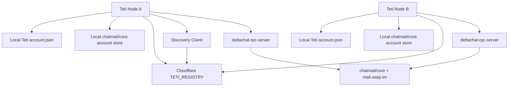
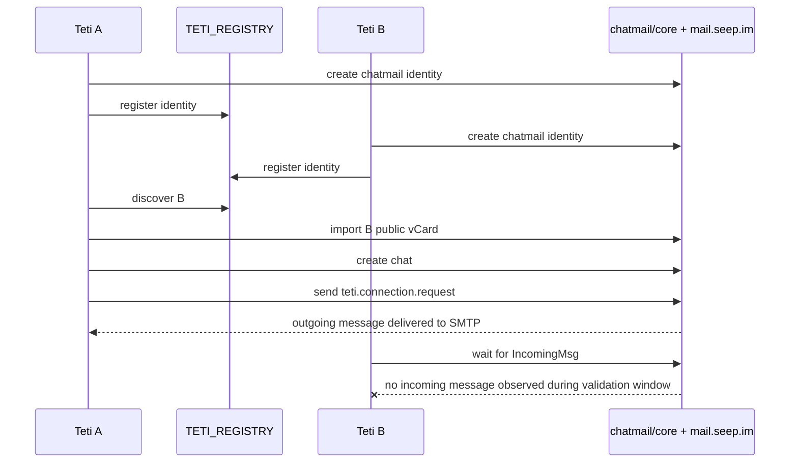

# Teti Alpha 1.0 Two Node End-to-End Test

Date: 2026-07-14

Scope: identity, discovery, real chatmail message bridge, and trust handshake readiness.

Out of scope:

- UI
- task collaboration
- generic message history
- custom encryption
- private key inspection

## Architecture



## Two-Node Sequence



## Test Command

The repeatable validation script is:

```sh
node --experimental-strip-types scripts/teti-alpha1-real-message-e2e.ts
```

The script creates two isolated local installation roots under the system temp directory. It uses:

- `deltachat-rpc-server`: `/Users/macstudio/Documents/AICoRun/core/target/release/deltachat-rpc-server`
- Registry: `https://teti-registry.seep2026.workers.dev`
- Chatmail onboarding QR: `dcaccount:mail.seep.im`

## Real Chatmail Message Bridge Validation

Implemented send path:

```text
import_vcard_contents when peer publicKey exists
  -> create_chat_by_contact_id
  -> misc_send_text_message
```

Fallback send path:

```text
lookup_contact_id_by_addr
  -> create_contact if missing
  -> create_chat_by_contact_id
  -> misc_send_text_message
```

Implemented receive path:

```text
get_next_event_batch
  -> IncomingMsg or MsgsChanged
  -> get_message
  -> parse Teti connection envelope

fallback:
  -> get_next_msgs
  -> get_message
  -> parse Teti connection envelope
```

## Latest Real Test Result

Temporary test root:

```text
/var/folders/h6/ddqf3jjj6pj7m1ksjxfnp5180000gn/T/teti-alpha1-real-message-GDgqCW
```

Node A:

```json
{
  "address": "5mo4zzvrv@mail.seep.im",
  "chatmailAccountId": 1,
  "registry": "ok"
}
```

Node B:

```json
{
  "address": "3bzhcbolv@mail.seep.im",
  "chatmailAccountId": 1,
  "registry": "ok"
}
```

Connection request:

```json
{
  "requestId": "7fc6d057-2459-4925-bf82-1d8cefa6ffdf",
  "nodeAState": "Requested",
  "nodeBState": "not received"
}
```

A-side chatmail message probe:

```json
[
  {
    "messageId": 13,
    "chatId": 12,
    "state": 20,
    "stateName": "OutPending",
    "showPadlock": true,
    "error": null
  },
  {
    "messageId": 13,
    "chatId": 12,
    "state": 26,
    "stateName": "OutDelivered",
    "showPadlock": true,
    "error": null
  }
]
```

B-side receive diagnostics:

```json
{
  "startIo": "ok",
  "eventKindsObserved": [
    "Info",
    "ConnectivityChanged",
    "NewBlobFile",
    "ImapConnected",
    "ImapInboxIdle"
  ],
  "messageEventsObserved": [],
  "nextMessageIds": [11],
  "fetchedMessages": [
    {
      "messageId": 11,
      "chatId": 11,
      "fromAddress": "device@localhost",
      "hasText": true,
      "parsedAsTeti": false
    }
  ]
}
```

Result:

```text
Identity birth: PASS
Registry registration: PASS
Discovery: PASS
RPC send bridge: PASS
Encrypted outgoing queueing: PASS
SMTP delivery from A: PASS
B-side IMAP receive: BLOCKED
Two-node Confirmed state: BLOCKED
```

## Confirmed Fixes

- The previous `ChatmailRpcUnavailableError` send blocker is resolved.
- Teti no longer attempts direct send-by-address.
- The adapter imports peer public vCards before sending when a public key is available.
- `getPublicIdentity()` normalizes Delta Chat vCard public keys so registry `publicKey` stores the key material, not a `data:` URI wrapper.
- Unit and integration-preparation tests pass for request, accept, malformed input, contact lookup, vCard import, chat creation, send, and receive parsing.
- Teti now handles `MsgsChanged` as a Desktop-confirmed new-message fallback.
- Teti now falls back to `get_next_msgs` when no message event appears in an event batch.
- Teti now emits safe receive diagnostics without logging message text or secrets.

## Remaining Blocker

The latest real run shows A can create and deliver an encrypted outgoing message through chatmail/core, but B does not observe an `IncomingMsg`, `MsgsChanged`, or `get_next_msgs` entry for A's message during the validation window. B does connect to IMAP and reaches `ImapInboxIdle`, so the remaining blocker appears below Teti's receive parser.

A follow-up diagnosis should focus on:

- `mail.seep.im` relay routing for freshly auto-provisioned chatmail accounts
- whether the recipient account needs a longer first-login/readiness gate before another node sends to it
- whether chatmail/core requires an additional account or transport readiness RPC before Alpha automated messaging
- server-side rejection or filtering after SMTP accepts the encrypted message
- whether a normal Delta Chat Desktop account can receive from the same freshly provisioned B address

No Teti crypto or protocol redesign is indicated by this result.

## Alpha 1.0 Readiness Assessment

Alpha identity and discovery are ready.

The real chatmail messaging bridge is implemented and passes local tests, but Alpha two-node trust is not fully ready until `mail.seep.im` delivery to the second freshly provisioned node is confirmed.
