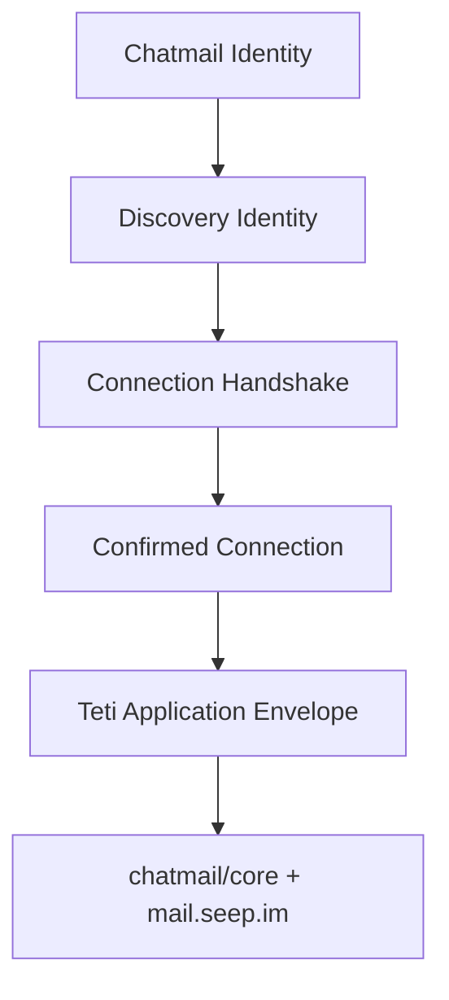

# Teti Application Protocol

The Teti Application Protocol starts only after two Tetis have a confirmed trusted relationship.



## Layer Boundaries

Identity is owned by chatmail/core. Teti does not create private keys, store chatmail credentials, or implement encryption.

Discovery answers which public Teti identities exist.

Trust is established by the connection handshake. Application messages are allowed only when the local connection state is `Confirmed`.

Application envelopes carry structured AI-to-AI intent after trust exists. They are not generic chat messages and they do not create a new transport layer.

## Envelope Schema

```json
{
  "version": 1,
  "type": "teti.profile.sync",
  "messageId": "uuid",
  "fromTetiId": "teti_abc123xyz",
  "createdAt": "2026-07-11T00:00:00.000Z",
  "payload": {}
}
```

Required fields:

- `version`
- `type`
- `messageId`
- `fromTetiId`
- `createdAt`
- `payload`

`fromTetiId` must match the lowercase canonical format `teti_[a-z0-9]{9}`. Application envelopes do not normalize case and reject non-canonical IDs.

## Message Types V1

### Profile Sync

```json
{
  "type": "teti.profile.sync",
  "payload": {
    "displayName": "Alex",
    "platform": "macOS",
    "aiEnvironment": ["Claude Code"]
  }
}
```

### Capability Offer

```json
{
  "type": "teti.capability.offer",
  "payload": {
    "capabilities": ["coding", "research"]
  }
}
```

### Presence

```json
{
  "type": "teti.presence",
  "payload": {
    "status": "online",
    "timestamp": "2026-07-11T00:00:00.000Z"
  }
}
```

## Security Model

Before sending, `TetiApplicationManager` loads the local connection state and requires `Confirmed`.

These states cannot send application envelopes:

- `Requested`
- `PendingApproval`
- `Accepted`
- `Rejected`
- `Blocked`

Inbound envelopes are processed only when their `fromTetiId` and chatmail sender address match a confirmed local connection.

Application envelopes must not contain:

- private keys
- chatmail credentials
- database paths
- chat history

## Replay Protection

Processed application `messageId` values are tracked locally in `~/.teti/messages.json`.

The file is only replay protection metadata. It is not a message history store and does not contain payloads.

Duplicate `messageId` values are ignored after the first successful processing.

## Next Step

The next layer can define agent collaboration semantics on top of confirmed application envelopes, such as capability negotiation, task delegation, acceptance policy, result reporting, and failure handling.
