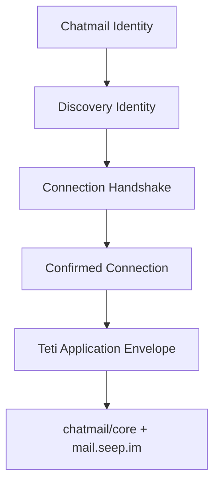

# Teti Application Protocol

The Teti Application Protocol starts only after two Tetis have a confirmed trusted relationship.


```mermaid
flowchart TD
  A["Chatmail Identity"] --> B["Discovery Identity"]
  B --> C["Connection Handshake"]
  C --> D["Confirmed Connection"]
  D --> E["Teti Application Envelope"]
  E --> F["chatmail/core + mail.seep.im"]
```

## Layer Boundaries

Identity is owned by chatmail/core. Teti does not create private keys, store chatmail credentials, or implement encryption.

Discovery answers which public Teti identities exist.

Trust is established by the connection handshake. Application messages are allowed only when the local connection state is `Confirmed`.

Application envelopes carry structured AI-to-AI intent after trust exists. They are not generic chat messages and they do not create a new transport layer.

## Envelope Schema

```json
{
  "version": 1,
  "type": "teti.profile.sync",
  "messageId": "uuid",
  "fromTetiId": "teti_abc123xyz",
  "createdAt": "2026-07-11T00:00:00.000Z",
  "payload": {}
}
```

Required fields:

- `version`
- `type`
- `messageId`
- `fromTetiId`
- `createdAt`
- `payload`

`fromTetiId` must match the lowercase canonical format `teti_[a-z0-9]{9}`. Application envelopes do not normalize case and reject non-canonical IDs.

Beta 0.1.13 limits the complete UTF-8 envelope to 128 KiB before JSON parsing,
rejects unknown top-level keys, and bounds identifiers and timestamps. Payload
schemas remain independently allowlisted. One malformed Chatmail message is
isolated and cannot block later valid messages in the same poll batch.

## Message Types V1

### Profile Sync

```json
{
  "type": "teti.profile.sync",
  "payload": {
    "displayName": "Alex",
    "platform": "macOS",
    "aiEnvironment": ["Claude Code"]
  }
}
```

### Capability Offer

```json
{
  "type": "teti.capability.offer",
  "payload": {
    "capabilities": ["coding", "research"]
  }
}
```

### Presence

```json
{
  "type": "teti.presence",
  "payload": {
    "status": "online",
    "timestamp": "2026-07-11T00:00:00.000Z",
    "taskProtocolVersions": [1, 2, 3],
    "passportSchemaVersions": [3]
  }
}
```

`taskProtocolVersions` is optional. Beta 0.1.14 advertises versions 1, 2 and 3
for Task version negotiation. `passportSchemaVersions` independently advertises
the AI Passport payload schemas the Peer can consume. Protocol capabilities
are stored separately from the latest Passport snapshot; receiving a payload
never silently changes the advertised capability.

### AI Passport Sync

`teti.ai.status.sync` keeps one application message type and evolves its
strictly validated payload schema:

| Payload schema | Meaning | Current behavior |
| --- | --- | --- |
| 1 | AI Resource (`tools`) | Receive-only historical compatibility |
| 2 | AI Resource plus coarse observed Agent | Receive-only historical compatibility |
| 3 | AI Resource plus Callable Agent, Capability, and Binding | Only outgoing schema |

Schema 3 does not carry installation state, executable or profile paths,
version strings, process state, command/arguments, Adapter identity, login
state, credentials, prompt, task input, or result content. Its Agent list is
derived only from Adapters that passed local qualification and were registered
in Runtime.

Every current Presence explicitly advertises `passportSchemaVersions: [3]`.
The sender selects the highest common version and sends exactly one payload.
Because the current local supported set contains only schema 3, an unknown Peer
receives schema 3 and an explicitly incompatible Peer receives no speculative
downgrade. Schema 1 and 2 remain strictly validated on receive for queued
historical messages, but they never influence outgoing negotiation. Once a
valid schema-3 snapshot is established, a delayed lower-schema message cannot
replace it.

### Chatmail Task Request

`teti.task.request` carries a strict `CollaborationTaskRequest`. Task protocol
v1 is the text-only compatibility floor. Task protocol v2 adds ordered parts:
one required bounded text part followed by up to four PNG/JPEG descriptors.
Image bytes never enter JSON. A request contains a Task ID, requester and target
Teti IDs, selected Passport offer and Capability IDs, creation time, and expiry.
It cannot contain a local Agent, Adapter, command, path, workspace, credential,
tool input, or execution grant.

### Chatmail Task Receipt

`teti.task.receipt` reports durable transport ingestion as `received`,
`duplicate`, `expired`, `conflict`, or `rejected`. It also advertises supported
Task versions. A receipt is not user consent and cannot trigger an Agent.

Beta 0.1.12 uses `(requesterTetiId, taskId)` for semantic idempotency. Duplicate
envelopes with identical immutable Task content create one local record; a
conflicting reuse of the Task ID never overwrites the original. The maximum
Task TTL is 24 hours.

### Chatmail Task Attachment

`teti.task.attachment` binds one Chatmail file to a Task image descriptor. The
payload contains the Task identities, purpose (`input` or `artifact`), bounded
metadata, SHA-256 digest and expiry. Artifact attachments also bind the
immutable `artifactId`. The receiver MIME-sniffs, dimension-checks and hashes
private staged bytes. Input images must verify before approval; result images
must verify before the result is shown as ready. Paths, EXIF/GPS and source
filenames are not protocol fields.

### Chatmail Task Status and Cancel

`teti.task.status` carries a monotonic revision and one A2A-aligned Task state.
Older or terminal-regressing revisions are ignored. `teti.task.cancel` is an
idempotent cancellation request. The requester UI continues to show
`cancellation requested` until a remote status confirms the terminal state.

### Chatmail Task Artifact

`teti.task.artifact` returns a strictly validated bounded Artifact after local
execution. Task protocol v1 returns the historical text Artifact. Protocol v2
supports multipart input and bounded text output. Protocol v3 additionally
supports a schema-v2 Artifact containing ordered text and verified PNG/JPEG
descriptors. Result image bytes travel in `teti.task.attachment` messages with
`purpose: "artifact"`; the Artifact JSON never contains local paths or bytes.

For `image-editing`, a text-only Adapter response is not a successful result.
The receiver emits `failed` with `TASK_IMAGE_RESULT_MISSING`, sends no Artifact,
and the requester never sees a false completed state. The sender persists every
generated image outside the transient Adapter workspace before marking local
execution complete.

Transport receipt, local approval, execution status and Artifact are separate
semantic events. Only the receiver's explicit `allow once` action creates a
short-lived local Execution Grant; grants never cross Chatmail.

## Security Model

Before sending, `TetiApplicationManager` loads the local connection state and requires `Confirmed`.

These states cannot send application envelopes:

- `Requested`
- `PendingApproval`
- `Accepted`
- `Rejected`
- `Blocked`

Inbound envelopes are processed only when their `fromTetiId` and chatmail sender address match a confirmed local connection.

Application envelopes must not contain:

- private keys
- chatmail credentials
- database paths
- chat history

## Replay Protection

Generic `TetiApplicationManager` consumers can track processed application
`messageId` values locally in `~/.teti/messages.json`.

The file is only replay protection metadata. It is not a message history store and does not contain payloads.

Duplicate `messageId` values are ignored after the first successful generic
processing. Production Task transport additionally deduplicates by Task ID so
retries with a new envelope or Chatmail message ID remain idempotent.

## Beta 0.1.13 Recovery Rules

- semantic Task ID deduplication is authoritative even when a retry has a new
  Application Envelope message ID;
- status revision and receipt time ordering cannot roll a terminal or newer
  state backward;
- a receipt too far in the future is rejected instead of pinning ordering;
- interrupted local work becomes `failed` with `TASK_RUNTIME_RESTARTED` after
  Runtime recovery and is reported to the requester;
- an expired local Agent login becomes `auth_required`; the receiver must log
  in locally and explicitly allow once again before a new execution attempt;
- all pending and authentication-required Tasks still expire at their original
  absolute TTL;
- a known Task-v1 peer continues to receive text-only requests and schema-v1
  text Artifacts.

These rules do not broaden permission scope, transmit credentials, or introduce
a public A2A endpoint.

## Beta 0.1.14 Image Artifact Rules

- Task protocol v3 is selected only after Presence or a receipt explicitly
  advertises it; image-editing is not sent to a lower-version Peer.
- Result image attachments are durably queued and sent before their immutable
  Artifact manifest. Completed status may still arrive first through Chatmail,
  so the requester shows `任务已完成 · 结果接收中` until verification finishes.
- An attachment or Artifact that arrives before its dependent local record is
  left unacknowledged for bounded retry instead of being silently discarded.
- A Chatmail message is marked seen only after validation and durable business
  processing succeeds. Transient persistence failures are retried.
- PNG/JPEG format, byte size, dimensions and SHA-256 must match the descriptor;
  local paths, credentials, prompt transcripts and source filenames remain
  outside the Application Envelope.
