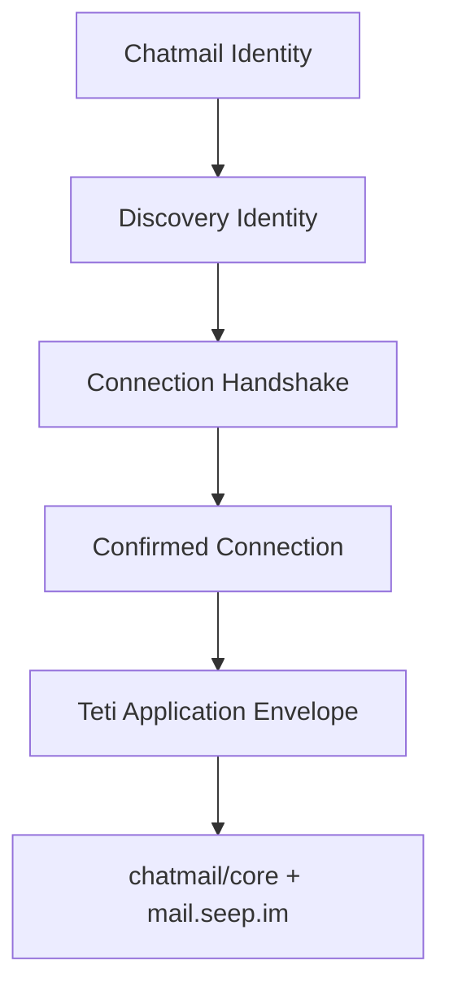

# Teti Application Protocol

The Teti Application Protocol starts only after two Tetis have a confirmed trusted relationship.


```mermaid
flowchart TD
  A["Chatmail Identity"] --> B["Discovery Identity"]
  B --> C["Connection Handshake"]
  C --> D["Confirmed Connection"]
  D --> E["Teti Application Envelope"]
  E --> F["chatmail/core + mail.seep.im"]
```

## Layer Boundaries

Identity is owned by chatmail/core. Teti does not create private keys, store chatmail credentials, or implement encryption.

Discovery answers which public Teti identities exist.

Trust is established by the connection handshake. Application messages are allowed only when the local connection state is `Confirmed`.

Application envelopes carry structured AI-to-AI intent after trust exists. They are not generic chat messages and they do not create a new transport layer.

## Envelope Schema

```json
{
  "version": 1,
  "type": "teti.profile.sync",
  "messageId": "uuid",
  "fromTetiId": "teti_abc123xyz",
  "createdAt": "2026-07-11T00:00:00.000Z",
  "payload": {}
}
```

Required fields:

- `version`
- `type`
- `messageId`
- `fromTetiId`
- `createdAt`
- `payload`

`fromTetiId` must match the lowercase canonical format `teti_[a-z0-9]{9}`. Application envelopes do not normalize case and reject non-canonical IDs.

## Message Types V1

### Profile Sync

```json
{
  "type": "teti.profile.sync",
  "payload": {
    "displayName": "Alex",
    "platform": "macOS",
    "aiEnvironment": ["Claude Code"]
  }
}
```

### Capability Offer

```json
{
  "type": "teti.capability.offer",
  "payload": {
    "capabilities": ["coding", "research"]
  }
}
```

### Presence

```json
{
  "type": "teti.presence",
  "payload": {
    "status": "online",
    "timestamp": "2026-07-11T00:00:00.000Z",
    "taskProtocolVersions": [1, 2]
  }
}
```

`taskProtocolVersions` is optional. Beta 0.1.12 advertises versions 1 and 2 for
passive Task version negotiation; older peers safely ignore it.

### AI Passport Sync

`teti.ai.status.sync` keeps one application message type and evolves its
strictly validated payload schema:

| Payload schema | Meaning | Beta 0.1.10 behavior |
| --- | --- | --- |
| 1 | AI Resource (`tools`) | Accepted; sent alone to a known schema-1 peer |
| 2 | AI Resource plus coarse observed Agent | Accepted; sent with an empty Agent list to a known schema-2 peer |
| 3 | AI Resource plus Callable Agent, Capability, and Binding | Current schema |

Schema 3 does not carry installation state, executable or profile paths,
version strings, process state, command/arguments, Adapter identity, login
state, credentials, prompt, task input, or result content. Its Agent list is
derived only from Adapters that passed local qualification and were registered
in Runtime.

Compatibility negotiation is passive and introduces no new handshake message.
An unknown confirmed peer receives schema 1 and schema 3 once. After Teti
receives a valid AI Passport payload from that peer, subsequent syncs use only
the peer's best known schema. A known schema-3 peer therefore never receives a
redundant legacy payload.

### Chatmail Task Request

`teti.task.request` carries a strict `CollaborationTaskRequest`. Task protocol
v1 is the text-only compatibility floor. Task protocol v2 adds ordered parts:
one required bounded text part followed by up to four PNG/JPEG descriptors.
Image bytes never enter JSON. A request contains a Task ID, requester and target
Teti IDs, selected Passport offer and Capability IDs, creation time, and expiry.
It cannot contain a local Agent, Adapter, command, path, workspace, credential,
tool input, or execution grant.

### Chatmail Task Receipt

`teti.task.receipt` reports durable transport ingestion as `received`,
`duplicate`, `expired`, `conflict`, or `rejected`. It also advertises supported
Task versions. A receipt is not user consent and cannot trigger an Agent.

Beta 0.1.12 uses `(requesterTetiId, taskId)` for semantic idempotency. Duplicate
envelopes with identical immutable Task content create one local record; a
conflicting reuse of the Task ID never overwrites the original. The maximum
Task TTL is 24 hours.

### Chatmail Task Attachment

`teti.task.attachment` binds one Chatmail file to a Task image descriptor. The
payload contains the Task identities, purpose, bounded metadata, SHA-256 digest
and expiry. The receiver MIME-sniffs and hashes private staged bytes before the
request can be approved. Paths, EXIF/GPS and source filenames are not protocol
fields.

### Chatmail Task Status and Cancel

`teti.task.status` carries a monotonic revision and one A2A-aligned Task state.
Older or terminal-regressing revisions are ignored. `teti.task.cancel` is an
idempotent cancellation request. The requester UI continues to show
`cancellation requested` until a remote status confirms the terminal state.

### Chatmail Task Artifact

`teti.task.artifact` returns a strictly validated bounded Artifact after local
execution. The qualified 0.1.12 Adapters emit text only. The v2 schema reserves
ordered image descriptors for a later separately tested image-result transport;
0.1.12 does not claim image Artifact delivery.

Transport receipt, local approval, execution status and Artifact are separate
semantic events. Only the receiver's explicit `allow once` action creates a
short-lived local Execution Grant; grants never cross Chatmail.

## Security Model

Before sending, `TetiApplicationManager` loads the local connection state and requires `Confirmed`.

These states cannot send application envelopes:

- `Requested`
- `PendingApproval`
- `Accepted`
- `Rejected`
- `Blocked`

Inbound envelopes are processed only when their `fromTetiId` and chatmail sender address match a confirmed local connection.

Application envelopes must not contain:

- private keys
- chatmail credentials
- database paths
- chat history

## Replay Protection

Generic `TetiApplicationManager` consumers can track processed application
`messageId` values locally in `~/.teti/messages.json`.

The file is only replay protection metadata. It is not a message history store and does not contain payloads.

Duplicate `messageId` values are ignored after the first successful generic
processing. Production Task transport additionally deduplicates by Task ID so
retries with a new envelope or Chatmail message ID remain idempotent.

## Next Step

Beta 0.1.13 hardens restart, duplicate, reordering, corrupt attachment,
timeout, expiry and old-peer recovery. It does not broaden permission scope or
introduce a public A2A endpoint.
