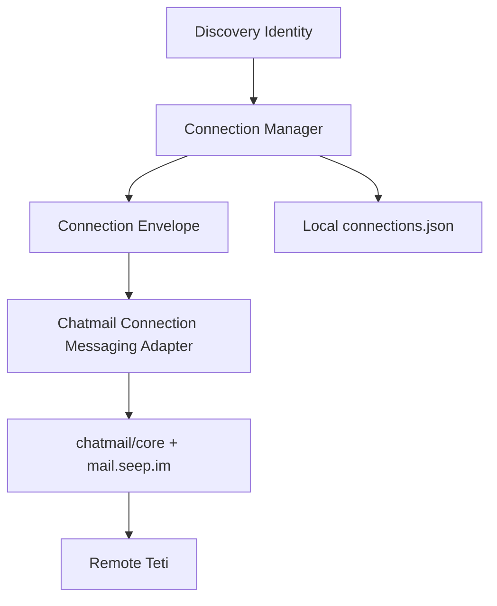
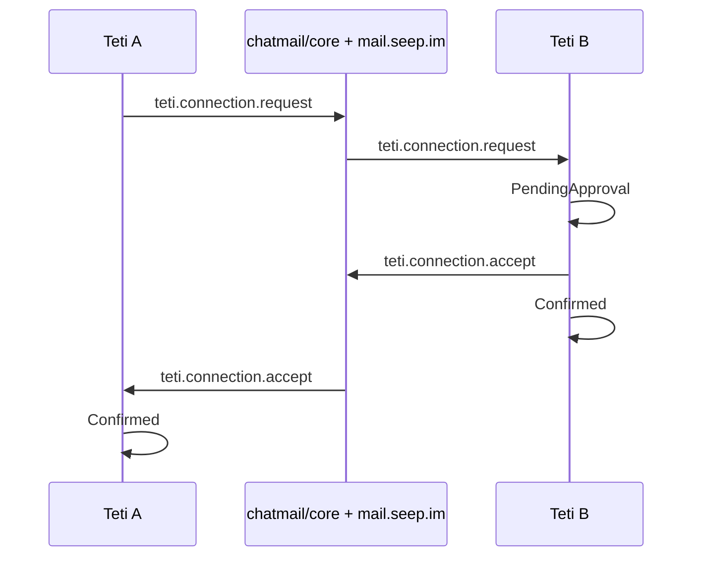

# Teti Connection Protocol

Teti Discovery answers who exists. Teti Connection answers how two discovered Tetis establish a trusted local relationship.



## Handshake Sequence



## Protocol Envelopes

Connection messages are JSON envelopes sent through chatmail text messages. Teti does not implement its own encryption or transport.

### Request

```json
{
  "type": "teti.connection.request",
  "version": 1,
  "payload": {
    "version": 1,
    "requestId": "uuid",
    "fromTetiId": "teti_xxx",
    "fromAddress": "xxx@mail.seep.im",
    "publicKey": "...",
    "profile": {
      "platform": "macOS",
      "aiEnvironment": ["Claude Code"]
    },
    "createdAt": "2026-07-11T00:00:00.000Z",
    "nonce": "random"
  }
}
```

### Accept

```json
{
  "type": "teti.connection.accept",
  "version": 1,
  "payload": {
    "version": 1,
    "requestId": "uuid",
    "fromTetiId": "teti_yyy",
    "fromAddress": "yyy@mail.seep.im",
    "createdAt": "2026-07-11T00:00:00.000Z",
    "nonce": "random"
  }
}
```

### Reject

```json
{
  "type": "teti.connection.reject",
  "version": 1,
  "payload": {
    "requestId": "uuid",
    "reason": "optional"
  }
}
```

The envelope also reserves `teti.profile.update` for future public profile sync.

## Connection State

Connection state is stored locally in `~/.teti/connections.json` and never stored in Cloudflare KV.

States:

- `Requested`: local Teti sent a request.
- `PendingApproval`: remote request received and waiting for local approval.
- `Accepted`: local user accepted; the accept message is being sent.
- `Confirmed`: both sides exchanged request and acceptance.
- `Rejected`: request was rejected locally or remotely.
- `Blocked`: relationship is blocked locally.

Stored records include `requestId`, `remoteTetiId`, `remoteAddress`, `state`, `createdAt`, `updatedAt`, and `confirmedAt` when confirmation completes.

`requestId` identifies a handshake attempt, while `remoteTetiId` identifies the current relationship. If both Teti instances send requests at the same time, accepting either request makes that request canonical and removes the other local attempts for the same `remoteTetiId`. A crossed request that arrives after the relationship is already `Confirmed` is handled idempotently and does not create another pending row. Loading a legacy store also reconciles `Confirmed` peers and removes stale waiting attempts for the same peer.

Creating a request is idempotent for an active peer relationship. The desktop bridge returns an explicit request outcome (`created`, `alreadyRequested`, `approvalRequired`, `confirming`, `alreadyConfirmed`, or `blocked`) so the UI can explain why no second message was sent and highlight the existing relationship.

## Discovery vs Connection

Discovery contains public registry data: Teti id, chatmail address, public key, and public profile.

Connection turns a discovered public identity into a local relationship. It uses chatmail for transport and stores only relationship state locally.

## Security Boundary

The protocol does not contain or store:

- private keys
- chatmail credentials
- local database paths
- chat history

Encryption, authentication, private key storage, and relay communication remain owned by chatmail/core.

## Future Application Messaging

Application messages should only be sent after the local connection state is `Confirmed`. The next layer should define message types, replay handling, and user-visible trust prompts while continuing to use chatmail/core for encrypted delivery.
