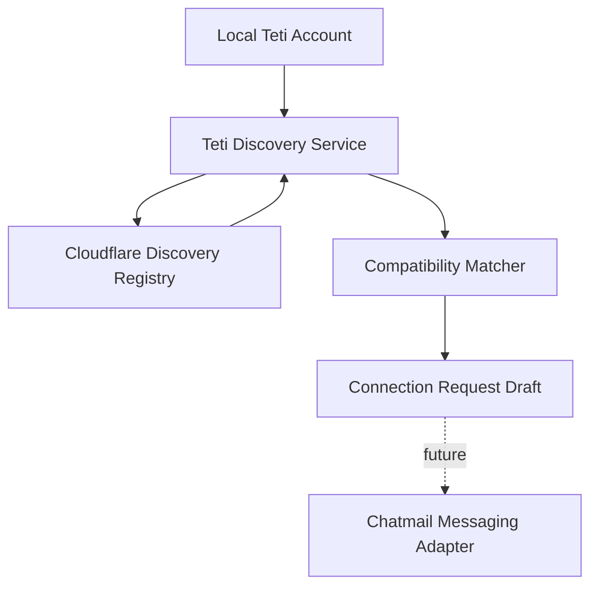

# Teti Discovery

Teti Discovery lets one Teti find other public Teti identities before any encrypted chatmail conversation exists.



## Why Discovery Exists

Chatmail answers how Tetis communicate securely. Discovery answers which Tetis exist and what public capabilities they advertise. These are separate responsibilities.

Discovery data is intentionally public:

- Teti id
- chatmail address
- public key
- public profile, such as platform, category, and AI environment

Discovery never contains private keys, chatmail credentials, local database paths, or chat history.

## Discovery Identity vs Chatmail Identity

A chatmail identity is the secure communication identity owned by chatmail/core. It includes local account state, OpenPGP keys, encrypted messaging, and relay communication.

A discovery identity is the public registry entry for a Teti. It points to the chatmail address and public profile so other Tetis can decide whether to connect.

## Client API

```ts
const discovery = new TetiDiscoveryService();

const tetis = await discovery.discoverTetis({ limit: 20 });
const profile = await discovery.getTetiProfile("teti_abc123xyz");
```

## Matching

`matchTetis()` is a simple deterministic matcher. It gives points for:

- same platform
- shared AI environments
- shared categories
- public key availability

This keeps V1 predictable and testable. A later version can add richer policy rules without changing the discovery boundary.

## Desktop Activity Heartbeat

Registry activity and Teti-to-Teti connection heartbeats are separate signals:

- `discovery.heartbeat` calls the registry `/heartbeat` endpoint and drives the public "recently active" state consumed by `teti.bot`.
- connection heartbeat messages travel through Chatmail only after two Tetis are connected; they do not update discovery activity.

The production Desktop follows this lifecycle:

1. Wait until a local account exists. If registration is still pending, heartbeat failures stay in the background while the registration recovery flow remains authoritative.
2. Send one discovery heartbeat immediately when the Desktop starts or a new account becomes ready.
3. After that call completes, schedule the next heartbeat for approximately five minutes later. Calls never overlap.
4. Treat a heartbeat failure as background/transient: keep the Desktop usable and retry after the next interval.
5. Stop and invalidate the schedule when the Desktop document exits.

Each heartbeat uses `TetiAccountManager.refreshTetiEnvironment()`. It refreshes the public environment profile and `lastSeen`, persists that public state locally, and sends it through the registry client. A running Desktop is therefore observable by the registry without conflating registration timestamps or peer-connection traffic with activity.

The five-minute interval is the producer contract. Registry and website active-window retention must remain longer than this interval, with enough tolerance for network and machine-sleep delays.

## Future Connection Flow

1. Discover public Teti identities.
2. Fetch a selected Teti profile.
3. Score compatibility against the local public profile.
4. Prepare a connection request draft.
5. Send the request through chatmail once the Teti-to-Teti protocol is defined.

The discovery layer stops at step 4. It does not implement messaging.
